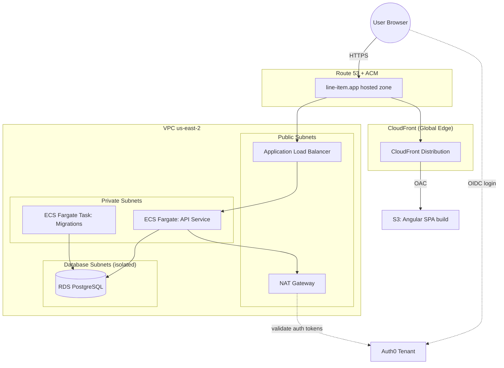

# line-item-infrastructure

Terraform infrastructure-as-code that provisions the complete AWS environment for **Line Item**, a full-stack web application (Angular SPA + .NET API + PostgreSQL). This repo is the "ops" half of the Line Item project: it stands up networking, compute, data, DNS/TLS, and CI/CD wiring so that application code shipped from GitHub Actions can be deployed with zero manual console work.

## What's Included

- **Networking** — a VPC with public, private, and isolated database subnets across 3 AZs, NAT gateway for outbound access from private workloads
- **Database** — a private, encrypted PostgreSQL instance (RDS) with credentials managed by AWS Secrets Manager (no passwords in state or code)
- **API** — an ECS Fargate service for the .NET API behind an Application Load Balancer, HTTPS via ACM, a companion Fargate task for running database migrations, and CloudWatch logging
- **Frontend** — an Angular SPA served as a versioned S3 bucket behind CloudFront (origin access control, SPA-routing rewrite function, custom domain)
- **Auth** — Auth0 tenant configuration as code: API resource server, scopes, RBAC roles, application client, custom login domain, and a post-login Action that injects custom claims
- **Global/shared resources** — Route 53 hosted zone + ACM certificates (one per region, since CloudFront requires us-east-1 while the ALB lives in us-east-2), ECR repositories for API/migration images, and a scoped IAM user for GitHub Actions
- **CI/CD integration** — GitHub Actions builds and pushes Docker images to ECR and SPA builds to S3; Terraform reads back the currently-deployed image tag (`data.aws_ecs_task_definition`) so `terraform apply` never fights the CI pipeline over which image is running

## Architecture



**Request flow:** Browser hits `api.line-item.app` / `line-item.app` → Route 53 → ALB (API) or CloudFront (SPA) → ECS Fargate tasks in private subnets → RDS Postgres in an isolated, internet-less subnet. Auth is offloaded entirely to Auth0 (OIDC); the API validates access tokens issued against the Auth0-managed resource server.

**Deploy flow:** GitHub Actions builds the API/migrations Docker images and the Angular production build, pushes to ECR/S3, then re-registers the ECS task definition with the new image tag and triggers a rolling service update — all authenticated as a narrowly-scoped IAM user created by this repo (`environments/global/iam`).

## Folder structure

```
line-item-infrastructure/
├── bootstrap/                    # One-time setup: S3 bucket that holds all Terraform remote state
│   ├── main.tf                   #   versioned, encrypted, public-access-blocked state bucket
│   ├── providers.tf
│   └── variables.tf
│
├── modules/                      # Reusable modules shared across environments
│   ├── angular-spa/               # S3 + CloudFront (OAC) + Route53 alias for a static SPA
│   ├── auth0-api/                 # Auth0 resource server, scopes, RBAC roles, custom-claims Action
│   └── auth0-app-client/          # Auth0 application client + custom login domain
│
└── environments/
    ├── global/                   # Resources shared by every environment/stage
    │   ├── ecr/                   # ECR repos for the api and migrations images
    │   ├── iam/                   # IAM user + access key used by GitHub Actions
    │   ├── route53/               # Hosted zone + ACM certs (us-east-1 for CloudFront, us-east-2 for ALB)
    │   └── s3/                    # Versioned bucket archiving frontend build artifacts
    │
    └── dev/                       # Per-stage stack (mirror this folder for staging/prod)
        ├── network/                # VPC: public / private / database subnets, NAT gateway
        ├── database/               # RDS PostgreSQL, security group, Secrets Manager-managed password
        ├── api/                    # ALB, ECS Fargate service + migrations task, Auth0 API config, GH Actions IAM policy
        └── app/                    # Angular SPA hosting (module call) + Auth0 app client (module call)
```

Each stack (`network`, `database`, `api`, `app`, and everything under `global/`) is an independent Terraform root module with its own S3 backend state file. Stacks consume each other's outputs via `terraform_remote_state` data sources rather than being tightly coupled — e.g. `api` reads the VPC ID from `network`'s state and the DB endpoint from `database`'s state. This keeps blast radius small: changing the API service can't accidentally touch the network or database state.

## Key Design Decisions

- **Isolated database subnets** — the database subnet group has no route to the internet at all, not just a security group rule, so RDS is unreachable from outside the VPC by construction.
- **Managed master password** — RDS's `manage_master_user_password` hands credential rotation to AWS Secrets Manager; the ECS task role is granted narrow `secretsmanager:GetSecretValue` access rather than the app holding a static password.
- **Deployment circuit breaker** — the ECS service enables automatic rollback on failed deployments.
- **CI-owned image tags** — Terraform intentionally reads the *currently running* image tag back from ECS (`data.aws_ecs_task_definition`) instead of hardcoding `:latest`, so applying Terraform never reverts a service to an old image after GitHub Actions has deployed a newer one.
- **Environment-per-folder** — `dev` is the only stage provisioned today; adding `staging` or `prod` is a matter of copying the `environments/dev` folder and adjusting the `locals` block (name prefix, instance sizes, NAT redundancy, etc.), not restructuring the modules.

## Tech stack

Terraform · AWS (VPC, RDS, ECS Fargate, ALB, S3, CloudFront, Route 53, ACM, ECR, IAM, Secrets Manager) · Auth0 · GitHub Actions
